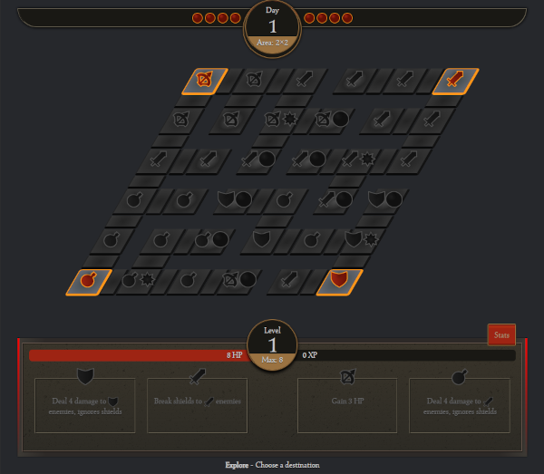

# Dungeons of Crimsonbranch

A tiny adventure dice game you can play on a computer, a mobile device, or a sheet of paper

---

<a href="https://www.kesiev.com/crimsonbranch">Play</a>

---

## The story

**The Great Evil is coming back to our lands!** Give your hero a name, bring it to the dungeons, collect the pearls, prepare for the ritual, and face The Great Evil once and for all!

    

## The game

_Dungeons of Crimsonbranch_ is a tiny adventure dice game you can play on a computer, a mobile device, or a sheet of paper, inspired by looter hack & slash RPG videogames. You can print your heroes sheets from the game's main menu: a standard A4 fits 2 heroes!

    

### Why?

A wide subset of board games are inspired by videogames: some manage to replicate the settings, others the rhythm, and others even some distinctive mechanics. Board game designers have boundless creativity: whether they're puzzle, action, or even real-time videogames, there probably is an analog version of them somewhere on BGG.

The tabletop dungeon crawlers market is very rich but, despite everything, there don't seem to be many Diablo-inspired board games... and I think for good reason.

    

    
Diablo 2 Resurrected by Blizzard

The [Diablo series](https://en.wikipedia.org/wiki/Diablo_(series)) stands out both for the immediacy of its gameplay and for the layered complexity of its character customization but, perhaps, the most distinctive and _hard-to-port_ feature is the infinite variety of carefully balanced items and accessories that can be found and equipped.

    

    
Filip Neduk's "Sanctum" board game

The board game [Sanctum](https://boardgamegeek.com/boardgame/276830/sanctum) found a sweet spot between immediacy and complexity but, to do so, it sacrificed the exploratory part and changed its collaborative nature to a competitive one.

After playing the beta of the next episode of Diablo, I decided to resume my research. I started playing several other videogames inspired by the series and tried to identify the most common features (aesthetic and mechanical) I prefer.

In the meantime, I've decided to _jot them down_ in a game prototype. I happened to waste several minutes of my lunch break playing it, so I've decided to give it a "Diablo" outfit to [play it better](markdown/kesievpaladin.png). My search is far from over... but at least now I have a new tiny timewaster to share!

### Credits

#### Music

  - [Demon Lord](https://opengameart.org/content/demon-lord) by Scrabbit
  - [Dark Quest](https://opengameart.org/content/dark-quest) by Alexandr Zhelanov
  - [Intrigue](https://opengameart.org/content/intrigue) by Alexandr Zhelanov

#### Sound effects

  - by [rubberduck](https://opengameart.org/content/100-cc0-sfx)
  - by [Vehicle](https://opengameart.org/content/fantasy-sound-effects-tinysized-sfx)
  - by [artisticdude](https://opengameart.org/content/rpg-sound-pack)
  - by [Darsycho](https://opengameart.org/content/big-scary-troll-sounds)

#### Font

The game is using the excellent CC0 font [Seshat](http://dotcolon.net/font/seshat/) by Dot Colon.